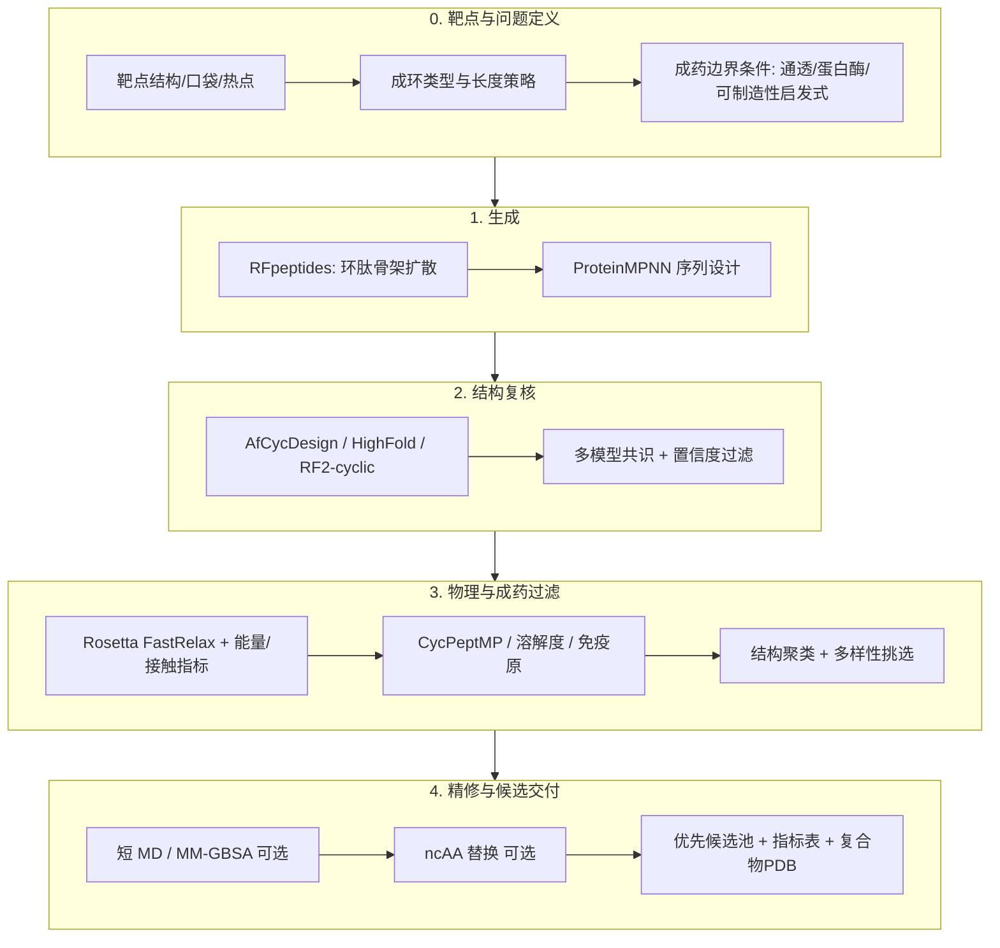

# AI 环肽药物设计：干实验流程与最佳技术选型

> **文档目的**：给出可落地、可复现的 AIDD 环肽**纯干实验**（in silico）端到端流程，并按 2024–2025 年**文献实验验证强度**给出技术选型建议。  
> **项目边界**：流程终点为**计算候选池与指标报告**；不包含合成下单、assay 执行或临床方案。文献湿测结果仅作选型证据。  
> **本仓库运行时**：战役脚本 **仅用 uv**（`uv sync` / `uv run`）；禁止系统 / conda Python。GPU 生成走 Docker。见 §9 与 PD-L1 战役规格 §0。  
> **检索日期**：2026-09-22  
> **文献索引**：`data/literature/ai_cycpeptide_sources.json`

---

## 1. 结论先行（Verdict）

当前**实验验证最强、应作为主线**的 de novo 靶向环肽设计管线是：

| 阶段 | 首选工具 | 证据强度 |
|------|----------|----------|
| 骨架生成 | **RFdiffusion 环化模式（RFpeptides）** | Nat Chem Biol 2025，多靶点 nM 级结合 + 结构吻合 |
| 序列设计 | **ProteinMPNN**（禁 Cys / 控 AA 组成） | 同上，优于传统物理方法溶解度 |
| 复合物验证 | **AfCycDesign** 和/或 **HighFold_Multimer**；可交叉 **RoseTTAFold2 环化** | Nat Commun 2025；BIB 2024 |
| 物理过滤 | **Rosetta FastRelax + iPAE / RMSD / ddG / CMS / SAP** | RFpeptides SI 标准过滤 |
| 膜通透（口服/胞内） | **CycPeptMP**（+ CycPeptMPDB） | BIB 2024 |
| ncAA / 非天然修饰 | **CyclicBoltz1 / AF3 基准评估** → 再 MD/能量 | 2025 preprint / JCIM 2025 |

**一句话**：Canonical 头尾环肽 binder → 走 **RFpeptides 主线**；需要二硫环 / 多约束 → 加 **HighFold**；需要膜通透 → 加 **CycPeptMP**；需要 ncAA → 在主线筛选后切到 **AF3 系（CyclicBoltz1）+ 物理化学精修**。

---

## 2. 干实验总览



### 2.1 按场景分流（先选路径，再选工具）

| 场景 | 推荐主路径 | 说明 |
|------|------------|------|
| **A. 细胞外 PPI / 表面口袋 binder** | RFpeptides → MPNN → AfCycDesign | 成功率最高；长度常见 8–18 aa |
| **B. 已知线性肽/热点锚定** | Motif scaffolding（RFdiffusion）或 AfCyc hallucination 骨架库 | 有实验肽时优先 motif |
| **C. 二硫键环肽** | CycleDesigner / HighFold（枚举二硫） | 头尾环 ≠ 二硫环，工具需显式约束 |
| **D. 口服 / 胞内靶点** | A 或 C + **CycPeptMP** 强过滤 + N-甲基化/D-aa 后期修饰 | 通透是瓶颈，勿只看亲和 |
| **E. 含 ncAA / 杂环大环** | Canonical 先筛 → CyclicBoltz1/AF3 → MD | 生成模型仍弱于验证模型 |

---

## 3. 分阶段流程（操作级）

### Stage 0 — 靶点与设计规格（Design Spec）

**输入**
- 靶点 PDB / AF2–AF3 模型；明确链、缺失环、辅因子、糖基化
- 结合位点：热点残基（hotspot）、PPI 界面、已知配体足迹
- 环化化学：头尾酰胺 / 二硫 / 硫醚 / 侧链–侧链点击化学
- 边界条件：长度、净电荷、Cys 策略、是否允许 D-aa / N-Me / 非蛋白原 aa

**最佳实践**
1. 用 **PyMOL / ChimeraX** 人工审口袋；用 **ConSurf / evolutionary conservation** 或已知 alanine scan 定义 hotspot。
2. 若仅有序列：先 **AF3 / Boltz-2 / ColabFold** 建靶点，再设计；环肽对接对靶点构象敏感。
3. 写出书面 Design Spec（长度范围、hotspot 列表、禁氨基酸、通透目标 logP_app）。

**产出**：`target.pdb`、`hotspots.json`、`design_spec.yaml`

---

### Stage 1 — 骨架生成（Backbone Generation）

#### 首选：RFpeptides（RFdiffusion + cyclic relative position encoding）

- 官方能力：`inference.cyclic=True` + `inference.cyc_chains='a'`（见 RosettaCommons/RFdiffusion README）
- 典型 contig：生成链长 12–18，对接靶点链，指定 `ppi.hotspot_res`
- 规模建议：每靶点 **5×10³–5×10⁴** 骨架（再靠过滤砍到百级）

**为何首选（相对 AfCyc hallucination 直接设计 binder）**
- RFpeptides 论文明确：AfCycDesign 直接做 de novo binder 成本高且当时未充分实验验证；扩散骨架 + MPNN 更可扩展，且可继承 epitope conditioning / motif scaffolding。
- 实验：多靶点高亲和力大环，含预测结构为靶的亚 10 nM binder。

#### 备选 / 互补
| 工具 | 何时用 |
|------|--------|
| **CycleDesigner (CycRFdiffusion)** | 需要开源整合脚本 + HighFold 一体化 |
| **AfCycDesign hallucination** | 先构建**单体稳定骨架库**（7–13 aa，pLDDT>0.9），再嫁接 binder |
| **DiffPepBuilder** | 侧重二硫环、序列–结构共设计；作旁路多样性来源 |
| Rosetta 物理宏环设计 | 仅作对照或极小化学空间精修，不作主生成器 |

---

### Stage 2 — 序列设计（Sequence Design）

#### 首选：ProteinMPNN

- 对 RFdiffusion 骨架批量采样（每骨架 1–8 条序列）
- 常用约束：`omit_AAs = C`（避免非预期二硫）；按项目限制 Met/Trp；可偏向带电/极性以提溶解度
- 温度：低 T（~0.1）提置信，高 T 提多样性

#### 不推荐作为主线
- 纯 Rosetta fixed-backbone design：环肽上成功率与溶解度通常弱于 MPNN（RFpeptides 明确偏好 MPNN）
- 无结构的纯 LLM 序列生成：可作早期 idea，不可跳过结构过滤

---

### Stage 3 — 结构预测与自我一致性（Self-consistency）

设计是否“成立”的核心判据：**用环化感知预测器重折叠后，骨架是否回到设计构象，且与靶点界面置信。**

| 工具 | 角色 | 备注 |
|------|------|------|
| **AfCycDesign** | **首选复核** | 环化 positional encoding；单体 X-ray RMSD <1 Å；可用于 redesign |
| **HighFold_Monomer / _Multimer** | 首选或并列 | 头尾 + 二硫；复合物优于经典对接基准中的 ADCP |
| **RoseTTAFold2 + cyclic offset** | 交叉验证 | RFpeptides 使用 |
| **AF3 / CyclicBoltz1** | ncAA / 晚期复核 | AF3 对非天然环肽有系统基准；D-肽手性仍有风险 |
| ColabFold AF-Multimer | 快速筛 | **默认线性编码会错**；必须改环化约束或改用 HighFold/AfCyc |

**关键过滤指标（与 RFpeptides / CycleDesigner 一致的思路）**
- 肽–靶 **iPAE / ipTM / 界面 pLDDT** 高置信
- 设计 vs 预测 **Cα RMSD**（肽整体与界面残基）低
- 可选：复合物预测与扩散骨架的一致性

---

### Stage 4 — 物理能量与可制造性过滤

#### 首选组合
1. **Rosetta FastRelax**（设计复合物）
2. 指标：`ddG`（结合）、接触分子表面积 **CMS**、表面聚集 **SAP**、形状互补、未满足氢键等
3. 结构聚类（Cα RMSD），每簇保留 Top 能量 / Top 置信

#### 对接（仅作补充，不作主设计引擎）
CPSet（493 个蛋白–环肽）结论要点：
- 有晶体构象时，小分子对接程序采样可以很好；**无先验构象时 ADCP 相对最好**
- **Rosetta 打分选姿最强**（top-1 docking success ~87.6%）
- **所有打分与亲和力相关性都弱**（最好约 Pearson 0.38）→ 对接亲和预测不可信，只作姿态势排序辅助

实用共识：**生成式设计 → AF 系复合物预测为主；ADCP / FlexPepDock 仅对可疑案例补采样。**

---

### Stage 5 — ADME / 膜通透 / 成药性

环肽最大干实验漏斗往往在这里，而非“会不会结合”。

| 任务 | 首选 | 说明 |
|------|------|------|
| 被动膜通透 | **CycPeptMP** | 原子/单体/肽多层特征；MAE≈0.355；数据自 CycPeptMPDB |
| 快速基线 | cyc-pep-perm / CYCLOPS | 轻量，适合大批量预筛 |
| 溶解度 / 聚集 | Rosetta SAP + 净电荷启发式 | 干实验代理；不作实验测定 |
| 蛋白酶稳定性 | 成环本身 + D-aa / N-Me 位点规则；无万能预测器 | |
| 免疫原 / MHC | 线性化肽段 MHC-I/II 预测作风险标注 | 弱证据，仅警示 |

**策略**：先保证结合置信与物理过滤，再对 Top 数百条跑通透模型；口服项目把通透阈值提高到与 iPAE 同级。

---

### Stage 6 — 精修（可选但高价值）

| 方法 | 用途 | 成本 |
|------|------|------|
| 短时 **OpenMM / GROMACS** 束缚 MD（10–100 ns） | 查界面稳定性、成环张力 | 中 |
| **MM-GBSA / MM-PBSA** | 相对排序（噪声大） | 中 |
| FEP / 绝对自由能 | 仅 Top 个位数；环肽收敛难 | 极高 |
| ncAA 替换 + **CyclicBoltz1** + MD | 代谢稳定、通透、专利空间 | 高 |
| QM/MM 界面残基 | 特殊催化/金属位点 | 高 |

---

### Stage 7 — 干实验交付清单（战役终点）

本仓库输出止于**可复现的计算候选包**（不写合成工单或 assay 协议）：

1. 氨基酸序列 + 成环化学定义（头尾 / 二硫位点 / 连接子）
2. 预测复合物 PDB + 指标表（iPAE、RMSD、ddG、通透分、足迹/遮挡分等）
3. 可制造性启发式标签（连续疏水、多 Cys、长环等风险标注）
4. 优先候选池（聚类后 Top N）+ 多样性分箱说明
5. 计算对照结果：阳性宏环 / 阴性随机环 / hotspot 偏离设计的过滤通过率

---

## 4. 最佳技术选型总表

### 4.1 核心栈（推荐采购/部署优先级）

| 优先级 | 组件 | 开源/许可 | GPU 需求 | 定位 |
|--------|------|-----------|----------|------|
| P0 | **RFdiffusion（含 RFpeptides 环化）** | 学术友好 / 注意商业条款 | 高（A100 级批量） | 骨架生成 |
| P0 | **ProteinMPNN** | 开源 | 中 | 序列 |
| P0 | **AfCycDesign 或 HighFold** | 开源（基于 AF2 权重条款） | 高 | 结构验证 |
| P0 | **Rosetta**（FastRelax、指标） | 学术许可 | CPU/部分 GPU | 过滤 |
| P1 | **CycPeptMP** + CycPeptMPDB | 开源 | 低–中 | 通透 |
| P1 | **ColabFold / LocalColabFold** | 开源 | 高 | 靶点与快速筛 |
| P2 | **Boltz-2 / AF3 / CyclicBoltz1** | 各异 | 高 | ncAA、亲和估计辅助 |
| P2 | **ADCP** | 开源 | CPU | 灵活环肽对接补盲 |
| P2 | **OpenMM** | 开源 | GPU | MD 精修 |
| P3 | DiffPepBuilder / DiffPepDock | 开源/论文代码 | 高 | 旁路多样性 |

### 4.2 数据与知识库

| 资源 | 用途 |
|------|------|
| **PDB** 环肽–蛋白复合物 | 微调、基准、热点迁移 |
| **CycPeptMPDB** | 通透监督数据 |
| **DRAMP / DBAASP / THPdb** 等 | 活性肽先验（注意与靶向 binder 分布偏移） |
| 可制造性启发式规则库 | 闭环：难合成模式反馈到 omit_AAs / 长度策略（仍为计算过滤） |

### 4.3 工程编排（工业落地）

- **战役 Python 环境（本仓库强制）**：[uv](https://github.com/astral-sh/uv) — `uv sync` 创建 `.venv`；一律 `uv run python scripts/...`；依赖见根目录 `pyproject.toml` / `uv.lock`  
- **禁止**：系统 Python、conda base 直接跑战役脚本  
- **GPU 重依赖**：RFdiffusion / ProteinMPNN torch 等用 **Docker**（与 uv 分工），勿塞进战役 `.venv`  
- 工作流引擎：**Nextflow** 或 **Snakemake**（GPU 队列 + 可复现容器；S3 后）  
- 运行追踪：**MLflow** 或简单 SQLite + parquet 指标表  
- 可视化：**ChimeraX** 批量；界面热图用自定义 Python（biopython + matplotlib，经 uv）

---

## 5. 推荐“标准战役”配置（可直接照抄）

### 配置 α — 细胞外 PPI binder（最高优先）

```
Target prep → RFpeptides (8–18 aa, hotspots) 
  → ProteinMPNN (omit C, 4 seq/backbone)
  → AfCycDesign + HighFold_Multimer 双模型共识
  → Rosetta FastRelax 过滤 (iPAE, RMSD, ddG, CMS, SAP)
  → 聚类取 24–96 条优先候选（计算交付）
```

### 配置 β — 口服 / 胞内

```
配置 α + CycPeptMP 强阈值
  → 对通透高分者做 N-Me / D-aa 定点扫描（CyclicBoltz1 复核）
  → 短 MD 查构象开关（通透相关“chameleonic”行为仅作假说）
```

### 配置 γ — 二硫约束环肽

```
CycRFdiffusion / DiffPepBuilder(二硫模块)
  → MPNN
  → HighFold（二硫枚举）为主
  → 其余同 α
```

---

## 6. 决策树（选型一页纸）

```
有可靠靶点 3D？
  ├─ 否 → 先 AF3/Boltz/ColabFold 建模并人工审口袋
  └─ 是 → 成环类型？
        ├─ 头尾酰胺 → RFpeptides 主线
        ├─ 二硫 → HighFold + 二硫感知生成
        └─ 复杂化学大环 → 化学信息学 + AF3/CyclicBoltz1，勿硬套 MPNN
需要膜通透？
  ├─ 是 → CycPeptMP 与结构过滤并重
  └─ 否 → 结构/能量过滤即可
需要 ncAA？
  ├─ 是 → Canonical 命中后再修饰；用 CyclicBoltz1/AF3，警惕 D-肽失败模式
  └─ 否 → 保持 20 aa + 可选 omit Cys
```

---

## 7. 常见失败模式与对策

| 失败模式 | 原因 | 对策 |
|----------|------|------|
| 高置信但不结合（文献常见） | 置信度≠亲和力；靶点构象错 | 多构象靶点；交叉构象复评；勿迷信 ipTM |
| 预测开环/线性化 | 未启用环化编码 | 强制 AfCyc/HighFold，禁用原版 AF-Multimer |
| 全是疏水聚集 | MPNN 无通透约束 | SAP 过滤 + 强制极性配额 + CycPeptMP |
| 二硫错配 | 多 Cys | omit Cys 或 HighFold 枚举后锁定 |
| D-肽镜像错 | AF3 手性局限 | 勿依赖 AF 做 mirror-image 设计 |
| 可制造性风险高 | 序列难合成模式 | 启发式规则过滤；限制连续疏水与氧化敏感残基 |

---

## 8. 能力边界（必须写进项目计划）

1. **生成模型训练数据稀缺**：环肽复合物远少于蛋白；泛化依赖几何先验与过滤，而非端到端“药效预测”。
2. **打分与 Kd 相关性弱**：所有对接/多数 ML 亲和模型只能**排序代理**，报告中不得写成实测亲和力。
3. **通透与结合常权衡**：chameleonic 性质难用静态结构完美描述；MD 成本高。
4. **许可证**：AlphaFold / Rosetta / RFdiffusion 商业使用需法务审。
5. **本项目止于干实验**：目标是把设计空间从 ~10⁴ 骨架收敛到 **10¹–10² 优先候选**；文献中的湿测验证强度用于**选型**，不构成本仓库交付义务。

---

## 9. 本仓库建议落地目录

```
cycpeptides/
├── pyproject.toml           # uv 依赖声明（战役脚本）
├── uv.lock
├── .venv/                   # uv sync 生成（勿提交）
├── README.md                # uv 用法
├── data/
│   ├── literature/
│   ├── targets/             # 靶点 PDB + hotspot + roadmap.yaml
│   └── raw_designs/
├── scripts/                 # 一律: uv run python scripts/...
├── results/
├── figures/
└── docs/
```

**环境入口（强制）**

```bash
uv sync
uv run python scripts/<script>.py
bash scripts/pdl1_smoke_all.sh   # GPU Docker + uv 评分
```

---

## 10. 关键文献（DOI）

1. Rettie et al. *Nat Chem Biol* 2025 — RFpeptides. doi: [10.1038/s41589-025-01929-w](https://doi.org/10.1038/s41589-025-01929-w)  
2. Rettie et al. *Nat Commun* 2025 — AfCycDesign. doi: [10.1038/s41467-025-59940-7](https://doi.org/10.1038/s41467-025-59940-7)  
3. Zhang et al. *JCIM* 2025 — CycleDesigner. doi: [10.1021/acs.jcim.5c00227](https://doi.org/10.1021/acs.jcim.5c00227)  
4. Zhang et al. *Brief Bioinform* 2024 — HighFold. doi: [10.1093/bib/bbae215](https://doi.org/10.1093/bib/bbae215)  
5. Li et al. *Brief Bioinform* 2024 — CycPeptMP. doi: [10.1093/bib/bbae417](https://doi.org/10.1093/bib/bbae417)  
6. CPSet docking benchmark. *JCIM* 2024. doi: [10.1021/acs.jcim.3c01921](https://doi.org/10.1021/acs.jcim.3c01921)  
7. CyclicBoltz1. *bioRxiv* 2025. doi: [10.1101/2025.02.11.637752](https://doi.org/10.1101/2025.02.11.637752)  
8. AF3 ncAA cyclic benchmark. *JCIM* 2025. doi: [10.1021/acs.jcim.5c01393](https://doi.org/10.1021/acs.jcim.5c01393)

---

*文档状态：基于公开文献的方法学选型；具体超参需按靶点校准。*

### 已落地靶点案例

- **PD-L1 × 大环肽** → [`docs/PDL1_大环肽_战役规格.md`](PDL1_大环肽_战役规格.md)（配置 α + PD-1 足迹；**§0 uv 运行时**；结构在 `data/targets/PDL1/`）
- 代码前评估 → [`docs/PDL1_设计方案科学评估与工程方案.md`](PDL1_设计方案科学评估与工程方案.md)；阶段表 → `data/targets/PDL1/roadmap.yaml`
- 环境入口 → 仓库根目录 [`README.md`](../README.md)（`uv sync` / `uv run`）
