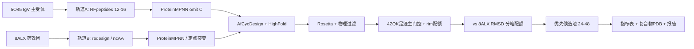

# PD-L1 大环肽 AI 干实验战役规格（Design Spec）

> **项目边界**：**纯干实验（in silico）**——本仓库只做结构设计、过滤、排序与候选池交付；**不包含**合成下单、assay 执行、动物/临床方案。  
> **运行时**：**战役 Python 仅用 uv**（`uv sync` / `uv run`）；禁止系统 / conda Python 跑 `scripts/`。RFdiffusion / ProteinMPNN GPU 栈走 Docker。详见 §0。  
> **靶点**：人 PD-L1（CD274 / B7-H1，UniProt Q9NZQ7）  
> **药物类型**：大环肽（macrocyclic peptide），优先头尾酰胺环；文献已知分子可含 N-Me、D-aa 等 ncAA（作对标，非本轮湿测）  
> **机制假设（计算代理）**：遮挡 PD-1/PD-L1 接触面 → 以 **PD-1 足迹重叠 + 极性边缘遮挡** 作为阻断代理指标  
> **场景归属**：细胞外 PPI / 平坦疏水面 → 主流程 **配置 α**（通透非第一瓶颈；CycPeptMP 弱权重）  
> **日期**：2026-09-22（同步：轨道 A 受体锁定 + 跨结构 hotspot 共识 + 差异化过滤；边界改为纯干实验；**uv 运行时**）  
> **结构文件**：`data/targets/PDL1/pdb/`

---

## 0. 运行时与环境（uv）

| 层级 | 工具 | 用途 |
|------|------|------|
| **战役脚本** | **uv** + 项目 `.venv` | 受体裁剪、足迹/rim 指标、校准、冒烟评分等 `scripts/pdl1_*.py` |
| **GPU 生成** | Docker `rosettacommons/rfdiffusion:latest` + `pdl1-afcyc` | RFpeptides / MPNN / AfCyc；权重与代码默认在本仓库 |
| **本地资产** | `models/`、`third_party/ProteinMPNN/` | 不依赖 sibling 项目路径；缺失时 `bash scripts/bootstrap_local_assets.sh` |
| **禁止** | 系统 Python / conda base | 不得直接 `python scripts/...` |

| 资产 | 默认路径 | 环境变量覆盖 |
|------|----------|--------------|
| RFdiffusion Complex_base | `models/rfdiffusion/` | `RFD_MODELS_DIR` |
| ProteinMPNN | `third_party/ProteinMPNN/` | `PROTEINMPNN_DIR` |
| AfCyc AF2 params | `models/afcyc/`（含 `params/`） | `AFCYC_PARAMS_DIR` |

```bash
cd /mnt/data4t/aidd/cycpeptides
uv sync
bash scripts/bootstrap_local_assets.sh         # 若 models/ / third_party 尚未就位
uv run python scripts/pdl1_prepare_receptor.py
uv run python scripts/pdl1_blockade_metrics.py
uv run python scripts/pdl1_calibrate_filters.py
bash scripts/pdl1_smoke_all.sh                 # Docker: RFD → MPNN → AfCyc；uv 评分
# NUM_DESIGNS=100 bash scripts/pdl1_smoke_all.sh
```

依赖声明：`pyproject.toml`（`requires-python >=3.11`；biopython / numpy / pandas / pyyaml）。锁文件：`uv.lock`。机器可读约定：`data/targets/PDL1/roadmap.yaml` → `runtime`；`design_spec.yaml` → `structures.runtime`。溯源：`models/SOURCES.md`。

**S2 三阶段（强制）**：RFpeptides（骨架）→ ProteinMPNN omit C（序列）→ **AfCycDesign**（环化复合物结构复核）。缺 AfCyc 不得将 S2 标为完成。

---

## 1. 科学判断（Verdict）

PD-L1 是**文献已验证大环肽可成药的靶点**：BMS 系列宏环肽（如 **BMS-986189 / BMT-174900**）有公开人体试验记录；Holak 实验室与 Bristol-Myers Squibb 公开多枚共晶（**5O45、7OUN、6PV9、8ALX、5O4Y**）。界面是 **IgV 的 CC′FG β-sheet 浅凹疏水面**——抗体可挡、小分子难挖深口袋，**大环肽几何匹配度高**。抗体 / BMS 宏环 / 部分小分子在**同一面结构收敛**；差异化应落在极性边缘化学、环取向族与格式，而非另找口袋。

推荐双轨：

| 轨道 | 目标 | 方法 |
|------|------|------|
| **A. De novo IP 友好** | 全新 canonical 头尾环肽 | RFpeptides + hotspot 条件生成（主受体 **5O45**） |
| **B. 已知药效团优化** | 对标 peptide 101/104 / BMS 系列 | 骨架固定 redesign / motif scaffolding → ncAA（药效团 **8ALX**） |

**干实验主放行标准（代理读出）**：优先 **PD-1 足迹遮挡（主门控）**，辅以 **rim 分项分/配额**、界面置信（iPAE / 界面 pLDDT）与物理能量；**不仅**要求“贴住 PD-L1 面”。文献湿测（HTRF/SPR 等）仅作方法学证据与外部对照描述，**不作为本仓库交付门控**。

---

## 2. 靶点与结构资产（已下载）

| PDB | 内容 | 分辨率 | 本项目用途 |
|-----|------|--------|------------|
| **8ALX** | PD-L1 + **pAC65**（文献高效力宏环，对标 BMS-986189） | **1.10 Å** | **轨道 B 药效团首选**（看肽怎么贴） |
| **5O45** | PD-L1 + peptide-57 宏环 | **0.99 Å** | **轨道 A 受体坐标首选**（分辨率最高的 PD-L1 链） |
| **7OUN** | PD-L1 + peptide 104 | 1.90 Å | **结合模式解读**；轨道 A **交叉构象**复评 |
| **5O4Y** | PD-L1 + peptide-71 宏环 | 2.30 Å | 与 5O45 **反向环走向**（Group II）；多样性对照 |
| **6PV9** | PD-L1 + macrocycle（含 D-Cys 等） | 2.00 Å | 足迹交叉验证 |
| **4ZQK** | PD-1/PD-L1 天然复合物 | 2.45 Å | 定义“必须遮挡”的 PD-1 足迹 |
| **5XXY / 5GRJ / 5X8M** | 抗体共晶 | — | 表位体积对照（不作主受体） |
| **5C3T** | Apo PD-L1 | — | 可选无配体偏置交叉 |

**设计用受体（已切链）**
- `PDL1_IgV_5O45_chainA.pdb`（轨道 A 主）
- `PDL1_IgV_8ALX_chainA.pdb` / `PDL1_IgV_7OUN_chainA.pdb`
- `PDL1_IgV_5O4Y_chainA.pdb`：取自 `5O4Y` **蛋白链 B**（ASU 中 B/C/E 为 PD-L1，A/D/F 为肽），重写为链 A；Group II 多样性受体。脚本：`scripts/extract_pdl1_5o4y_receptor.py`

### 轨道分工（锁定，避免混用评价标准）

| 用途 | 选谁 | 选它的理由 | 不选其它的理由 |
|------|------|------------|----------------|
| **轨道 A 主受体 PDB**（RFpeptides 只吃 PD-L1 坐标） | **5O45 chain A** | 0.99 Å，侧链几何最准；界面 Cα 与 7OUN/8ALX 差 ~0.4 Å | 7OUN 分辨率差、B 因子高；“肽姿势干净”对 de novo **不进损失函数** |
| **轨道 B 药效团模板** | **8ALX** | pAC65 文献效力近 mAb、对标公开 BMS 几何 | 作轨道 A 主受体易烙入 BMS 几何（IP） |
| **结合模式解读** | **7OUN**（+ 4ZQK） | peptide 104 单取向、非分叉 | 解读优势 ≠ 受体分辨率优势 |
| **交叉构象复评** | 7OUN / 8ALX（尤其 Met115） | 侧链 rotamer 配体依赖 | 过滤阶段用，不替代主生成受体 |

此前表述不一致的原因：第一次用 7OUN，看重的是**肽结合模式干净**；后来把**受体分辨率**也叫成“轨道 A 首选”。现已拆开锁定；§5 流水线与示例命令已与上表对齐。

### 还有哪些类别？

| 优先级 | 代表 PDB | 为何合适 / 不合适 |
|--------|----------|-------------------|
| ★★★ | 上表宏环共晶 | 直接相关 |
| ★★ | **4ZQK**；抗体 **5XXY / 5GRJ / 5X8M** | 阻断表位体积；不作 RFdiffusion 主受体 |
| ★ | Apo **5C3T / 5JDR** | 无配体偏置，轨道 A 可选交叉 |
| ✗ | 小分子二聚体 **5N2F / 5J89 / 5NIU / 6NM8** | 机制不同，勿作大环模板 |

> 注意：小分子 BMS-1166 等诱导 **PD-L1 二聚**，机制与宏环肽“盖住 PD-1 面”不同。本战役按 **单体 IgV 面阻断** 建模，不要混用二聚口袋。

---

## 3. Hotspot 定义（跨结构共识，2026-09-22）

**方法**：5 枚宏环（7OUN / 5O45 / 8ALX / 5O4Y 共识 / 6PV9）+ `4ZQK` PD-1 + 抗体（5XXY/5GRJ/5X8M）；重原子 ≤4.5 Å；配体含 **ncAA HETATM**（否则漏计 pAC65–Arg125）。  
脚本：`scripts/pdl1_hotspot_consensus.py` → `results/PDL1/hotspot_consensus.*`

### 3.1 核心 hotspot（RFdiffusion `ppi.hotspot_res` 必选，≤6）

宏环 4–5/5 共识 ∩ PD-1 足迹（Tyr123 另因 PD-1 最密接触对=55 保留）：

| 残基 | 宏环命中 | PD-1 接触对 | 角色 |
|------|----------|-------------|------|
| **Tyr56** | 5/5 | 18 | 中央疏水/芳香锚 |
| **Tyr123** | 5/5 | **55** | PD-1 最密；第二芳香锚 |
| **Met115** | 5/5 | 9 | 疏水沟 + S/π |
| **Arg113** | 5/5 | 17 | 静电/堆叠边缘 |
| **Gln66** | 5/5 | 23 | 极性锚定；pAC65 最密之一 |
| **Ala121** | 4/5 | 15 | 浅沟底 |

推荐 RFdiffusion 字符串（链 A，与 7OUN/5O45 UniProt IgV 编号一致）：

```text
ppi.hotspot_res=['A56','A123','A115','A113','A66','A121']
```

> **原则**：不要把 `hotspot_res` 扩到 ≥10（多样性坍缩）。Ile54/Glu58/Val76 虽宏环 5/5，但 PD-1 弱 → 仅过滤加分。

### 3.2 扩展接触（过滤加分，生成阶段一般不写入 hotspot_res）

`Ile54, Glu58, Val76, Ser117, Asn63`（宏环常见）  
`Asp122`（PD-1 密、宏环偏弱——见下节 rim 评分）

### 3.3 阻断差异化残基（rim 评分，非 AND 硬门控）

相对“再盖一次 Tyr56–Tyr123”，统计缺口与 IP 分流在此。**注意**：文献阳性宏环几乎都不同时接触三者（本地 ≤4.5 Å 复核：7OUN 缺 R125；5O45 缺 K124/R125；8ALX 仅稳触 R125）。故 **禁止** `D122 ∧ K124 ∧ R125` 作为默认一票否决。

| 残基 | 宏环命中 | PD-1 | 策略 |
|------|----------|------|------|
| **Lys124** | 1/5 | 第二密（27） | **最佳宏环空白**；rim 分项加分 + 优先池配额 |
| **Arg125** | 1/5（主要为 pAC65） | 16；抗体 3/3 | BMS 酰化-Trp 盐桥位；轨道 A 用 **Asp/Glu/Arg canonical 柄** 替代（加分） |
| **Asp122** | 2/5 | 19 | 极性沟；canonical 极性锁（加分） |

**主门控**仍是 PD-1 足迹重叠；rim 用于排序与多样性/差异化配额。详述：`results/PDL1/differentiation_opportunities.md`；评估：`docs/PDL1_设计方案科学评估与工程方案.md`

机器可读：`data/targets/PDL1/hotspots.json`、`hotspots_ranked.json`  
完整 YAML：`data/targets/PDL1/design_spec.yaml`

---

## 4. 药物设计规格

| 项目 | 设定 | 理由 |
|------|------|------|
| 成环化学（轨道 A） | **头尾酰胺** | RFpeptides 原生；化学定义清晰、便于后续格式化输出 |
| 长度 | **12–16 aa**（主）；可扩 10–18 | 已知活性宏环多为 ~14–15；β-hairpin 友好 |
| 二级结构偏好 | β-hairpin / 扁平疏水斑块 | 与 7OUN/5O45 结合模式一致；保留 **5O4Y 反向族** |
| 氨基酸 | 20 标准 aa；**omit Cys** | 避免非预期二硫；后期再引入定向 Cys/缀合手柄 |
| 净电荷 | 目标约 **0 到 +2** | 界面偏疏水；极性边缘用 Asp/Glu/Arg 补偿 |
| 疏水配额 | 允许较高 Phe/Trp/Ile/Leu | 界面需要疏水斑；用 SAP 防聚集 |
| ncAA（轨道 B） | N-Me、D-aa、Sar 等 | 对标 BMS；**第二阶段计算**；勿在轨道 A 复制酰化-Trp–Arg 盐桥 |
| 通透权重 | CycPeptMP **弱权重** | 细胞外表位假设；非口服优先战役 |
| IP 策略 | 轨道 A 序列新颖 + 非 BMS 极性柄；轨道 B 内部对标 | BMS 宏环专利密集 |
| 差异化主轴 | ① K124/R125/D122 极性边缘 ② Group II 反向环 ③ 偏心遮挡+缀合格式 | 见 §3.3 与差异化报告 |

---

## 5. 推荐干实验流水线（PD-L1 定制）



### Stage 参数建议

**轨道 A — De novo**
```bash
# 示意：RFpeptides binder（实际路径按本地 RFdiffusion 安装调整）
run_inference.py \
  'contigmap.contigs=[12-16 A18-134/0]' \
  inference.input_pdb=data/targets/PDL1/pdb/PDL1_IgV_5O45_A18-134.pdb \
  inference.cyclic=True \
  inference.cyc_chains='a' \
  "ppi.hotspot_res=['A56','A123','A115','A113','A66','A121']" \
  inference.num_designs=10000 \
  diffuser.T=50
```
随后：ProteinMPNN（4 seq/backbone，omit C）→ AfCycDesign/HighFold → Rosetta FastRelax。  
**交叉构象**：Top hits 用 `PDL1_IgV_7OUN_chainA.pdb`（及可选 8ALX）复评，关注 Met115 rotamer 敏感设计。

**轨道 B — 已知大环**
1. 以 **8ALX（首选）** / 7OUN / 5O45 肽骨架为 motif，RFdiffusion partial diffusion 或 AfCyc redesign。  
2. Canonical 命中后，用 **CyclicBoltz1/AF3** 评估 N-Me / D-aa 类似物（对标 BMS：应变能常主导 ΔG）。  
3. 专利规避：序列与连接化学偏离公开 BMS/Holak 系列；**内部对标，非主披露**。

### 过滤阈值（PD-L1 专用）

| 指标 | 建议门槛（初筛，可调） |
|------|------------------------|
| 肽–PD-L1 iPAE / 界面 pLDDT | 高置信分位 Top 10–20% |
| 设计 vs 预测 Cα RMSD | < 2.0 Å（肽） |
| Rosetta ddG / CMS | 优于池内中位数 |
| SAP / 聚集风险 | 剔除极端疏水暴漏 |
| **PD-1 足迹重叠（主门控）** | 与 4ZQK PD-L1 接触残基 Jaccard 或体积遮挡 > **校准阈值** |
| **rim 差异化（软）** | Asp122 / Lys124 / Arg125 **分项计分**；优先池保留高 rim 配额（**非**三者 AND） |
| **多样性（轨道 A）** | vs **8ALX** 肽骨架 Cα RMSD 分箱；**配额保留**高 RMSD 簇（反向/偏心）；近 BMS 几何降权 |
| 与已知宏环 RMSD（轨道 B） | 可要求接近 8ALX 药效团 |

---

## 6. 干实验交付与计算对照

### 6.1 交付物（本战役终点）

每轮输出应可复现、可排序，**止于候选池与报告**：

1. **序列 + 成环定义**：头尾酰胺；长度；omit AA 记录  
2. **预测复合物 PDB**（设计构象 + AfCyc/HighFold 复评）  
3. **指标表**（parquet/CSV）：iPAE、界面 pLDDT、Cα RMSD、ddG、CMS、SAP、PD-1 足迹 Jaccard、D122/K124/R125 遮挡分、vs-8ALX RMSD 分箱、可选 CycPeptMP  
4. **优先候选池**：聚类后 **24–48** 条（轨道 A 为主）；含多样性分箱说明  
5. **溯源**：输入 PDB、hotspot 字符串、过滤阈值版本、软件/权重版本  

> 本仓库**不**输出合成工单、湿测协议或给药方案。若外部另开湿测，可引用本指标表作优先级参考，但不在战役规格内承诺。

### 6.2 计算对照（必做，阈值校准用）

在放行设计肽之前，用同一套 AfCyc / HighFold / Rosetta / 足迹过滤跑通对照：

| 类型 | 做法 | 期望 |
|------|------|------|
| **阳性骨架** | 7OUN peptide-104 / 8ALX pAC65（或公开坐标肽）走完整过滤 | 应稳定通过；用于**校准** Top% / Jaccard / 遮挡阈值 |
| **阴性骨架** | 随机头尾环、或故意不盖 Y56/Y123 的偏离设计 | 应大量落选 |
| **基线 / 假结合** | 受体自洽分；“只贴面、不遮挡 PD-1”的簇 | 由 **足迹主门控**剔除；rim 低分降权 |
| **机制对照（计算）** | 勿用小分子二聚口袋结构作宏环阳性模板 | 确认模型的是 **IgV 面遮挡**，非二聚诱导 |

未用阳性宏环校准前，**不要**把过滤分位数当成绝对活性预测。

### 6.3 代理读出层级（in silico）

| 优先级 | 代理指标 | 对应的科学问题 |
|--------|----------|----------------|
| **P0** | PD-1 足迹遮挡（校准阈值） | 是否像“阻断剂”而非“只贴面” |
| **P0.5** | D122/K124/R125 **rim 分项分** + 配额 | 极性边缘差异化（非 AND 硬门） |
| **P1** | 双模型结构共识 + RMSD / iPAE | 设计是否自洽、界面是否可信 |
| **P2** | Rosetta ddG / CMS / SAP | 物理合理性与聚集风险 |
| **P3** | vs-8ALX RMSD 分箱配额 | IP / 取向多样性 |
| **P4（弱）** | CycPeptMP / 净电荷启发式 | 通透与电荷；配置 α 不卡门控 |

---

## 7. 风险与对策

| 风险 | 对策 |
|------|------|
| 平坦界面假阳性高 | 强制 hotspot + **PD-1 足迹主门控** + rim 配额；双模型共识；**计算阳/阴对照齐套** |
| 专利与 FTO | 轨道 A 为主披露；避开 pAC65 式酰化-Trp–Arg 盐桥；轨道 B 仅内部对标 |
| 人/鼠界面分歧（序列簇） | 按鼠 PD-L1 对应残基保守性做 **in silico 分簇标注**（非动物实验计划） |
| 过度疏水 / 聚集 | SAP + 强制 1–2 个溶剂暴露极性残基（对标 104，非 BMS 酰化柄） |
| 与抗体/BMS 面收敛内卷 | 极性边缘重构 + Group II 取向 + 缀合/偏心格式 |
| 单构象假阴性 | Top hits 对 7OUN/8ALX 交叉复评（Met115） |
| 假差异化 | 勿转小分子二聚口袋；勿 hotspot_res ≥10 |
| 把分位数当活性 | 先用公开宏环校准阈值；报告中标明“排序代理，非 Kd 预测” |

---

## 8. 本战役文件清单

| 路径 | 说明 |
|------|------|
| `docs/PDL1_大环肽_战役规格.md` | 本文 |
| `docs/PDL1_设计方案科学评估与工程方案.md` | 代码前科学评估 + 工程方案 |
| `data/targets/PDL1/design_spec.yaml` | 机器可读规格（含 `runtime: uv`） |
| `data/targets/PDL1/roadmap.yaml` | 多阶段状态机（门控与 DoD；含 `runtime: uv`） |
| `data/targets/PDL1/thresholds_v1.yaml` | S1c 校准主门控阈值 |
| `data/targets/PDL1/hotspots.json` | hotspot / 阻断 rim 优先残基 |
| `data/targets/PDL1/hotspots_ranked.json` | 共识排序推荐集 |
| `pyproject.toml` / `uv.lock` | **uv** 战役 Python 依赖 |
| `README.md` | uv 环境与常用命令 |
| `models/rfdiffusion/` | RFdiffusion Complex_base（本地，gitignore 大文件） |
| `models/afcyc/params/` | AfCyc / AF2 参数（本地） |
| `models/SOURCES.md` | 模型资产溯源 |
| `third_party/ProteinMPNN/` | 战役自带 ProteinMPNN 代码 + vanilla weights |
| `scripts/bootstrap_local_assets.sh` | 从历史 sibling 路径复制本地资产 |
| `results/PDL1/hotspot_consensus.csv` | 全残基接触统计表 |
| `results/PDL1/hotspot_consensus.json` | 共识 JSON（含逐复合物摘要） |
| `results/PDL1/differentiation_opportunities.md` | 差异化机会报告 |
| `results/PDL1/smoke/SMOKE_REPORT.md` | S2 冒烟报告（uv + Docker） |
| `scripts/pdl1_prepare_receptor.py` | S1a 受体裁剪（`uv run`） |
| `scripts/pdl1_blockade_metrics.py` | S1b 足迹 / rim 指标 |
| `scripts/pdl1_calibrate_filters.py` | S1c 阈值校准 |
| `scripts/pdl1_smoke_all.sh` | S2 冒烟编排：RFD → MPNN → **AfCyc** → uv 评分 |
| `scripts/pdl1_smoke_afcyc.sh` | S2c AfCycDesign Docker 冒烟 |
| `scripts/pdl1_hotspot_consensus.py` | 共识统计脚本 |
| `scripts/pdl1_rfpeptides_example.sh` | 指向 smoke / uv 入口 |
| `scripts/extract_pdl1_5o4y_receptor.py` | 从 5O4Y 正确切出 PD-L1（B→A） |
| `data/targets/PDL1/pdb/*.pdb` | 原始 + 切链 + A18–134 裁剪结构 |
| `data/literature/pdl1_macrocycle_sources.json` | 文献索引 |

---

## 9. 关键文献

1. Zyla et al. peptide 104 / **7OUN** — *Molecules* 2021. doi: [10.3390/molecules26164848](https://doi.org/10.3390/molecules26164848)  
2. Magiera-Mularz / Holak — bioactive macrocycles / **5O45**. doi 相关：Bioactive Macrocyclic Inhibitors of PD-1/PD-L1  
3. pAC65 / **8ALX** — *J Exp Clin Cancer Res* 2023. doi: [10.1186/s12943-023-01853-4](https://doi.org/10.1186/s12943-023-01853-4)  
4. PD-L1–macrocycle **6PV9** footprinting + X-ray — PMC7485629  
5. Zak et al. **4ZQK** PD-1/PD-L1.  
6. BMS 宏环优化（BMS-986189）— *J Comput Aided Mol Des* 2023. doi: [10.1007/s10822-023-00524-2](https://doi.org/10.1007/s10822-023-00524-2)  
7. 通用生成管线：RFpeptides *Nat Chem Biol* 2025. doi: [10.1038/s41589-025-01929-w](https://doi.org/10.1038/s41589-025-01929-w)

---

## 10. 下一步多阶段任务（干实验）

> **默认主线 = 轨道 A**。各阶段串行依赖；阶段内可并行。全部止于计算候选池，不进入合成/湿测。

| 阶段 | 状态 | 目标 | 关键产出 |
|------|------|------|----------|
| **S0 规格与资产** | ✅ 已完成 | 受体锁定、hotspot 共识、差异化轴 | `design_spec.yaml`、`hotspots*.json`、本文、`differentiation_opportunities.md` |
| **S1 过滤与对照脚手架** | ✅ 已完成 | 裁剪 + 足迹/rim + 校准（**uv run**） | `thresholds_v1.yaml`、`filter_calibration/` |
| **S2 轨道 A 冒烟** | ✅ 已完成 | **三阶段**：RFD → MPNN → **AfCyc** + uv 评分 | `results/PDL1/smoke/`（含 `afcyc/`） |
| **S3 轨道 A 主生成** | ⬜ 待做 | 规模化骨架 + 序列 | ~10k 骨架 × 4 seq |
| **S4 结构复核 + 物理过滤** | ⬜ 待做 | 双模型共识 + Rosetta | 高置信子集 |
| **S5 阻断代理 + 多样性** | ⬜ 待做 | PD-1 足迹门控 + rim/vs-8ALX **配额** | 分箱后的优先池 |
| **S6 交付打包** | ⬜ 待做 | 指标表 + PDB + 溯源报告 | **24–48** 优先候选 |
| **S7 轨道 B（可选）** | ⏸ 后置 | 8ALX 药效团 redesign / ncAA | 内部对标池（非主披露） |

### S1 — 过滤与对照脚手架（优先于大规模生成）

> 以下 Python 一律：`uv run python scripts/...`

1. **受体裁剪**：`uv run python scripts/pdl1_prepare_receptor.py` → `PDL1_IgV_5O45_A18-134.pdb`；校验 hotspot 齐全。  
2. `uv run python scripts/pdl1_blockade_metrics.py`：足迹 Jaccard / rim 分项分（禁止默认三者 AND）。  
3. `uv run python scripts/pdl1_calibrate_filters.py`：阳/阴对照 → `thresholds_v1.yaml`；轨道 A **配额保留**高 vs-8ALX RMSD 簇。  
4. 阳性（7OUN-104 / 8ALX-pAC65 / 5O45-57）须能过 **P0 足迹**；阴性大量落选。  
5. 产出：`results/PDL1/filter_calibration/` + 阈值版本号。详见工程方案文档。

### S2 — 轨道 A 冒烟（三阶段强制）

> 干实验主线的结构复核环是 **AfCycDesign**，不是可选项。S2 DoD = 三条都跑通。

1. 确认裁剪后的 `PDL1_IgV_5O45_A18-134.pdb` 与 contig `A18-134`、`ppi.hotspot_res` 一致。  
2. `bash scripts/pdl1_smoke_all.sh` 依次：  
   - Docker **RFpeptides**（cyclic binder）  
   - Docker **ProteinMPNN**（omit C）  
   - Docker **AfCycDesign**（环化复合物预测；镜像 `pdl1-afcyc`）  
   - `uv run python scripts/pdl1_smoke_score.py`（优先对 AfCyc 预测结构打足迹/rim）  
3. 产出：`results/PDL1/smoke/{rfpeptides,mpnn,afcyc}/` + `SMOKE_REPORT.md`；**缺 AfCyc 则 S2 未完成**，不进入 S3。  
4. 扩规模：`NUM_DESIGNS=100 bash scripts/pdl1_smoke_all.sh`（AfCyc 可用 `AFCYC_LIMIT` 先抽测再全量）。

### S3 — 轨道 A 主生成

1. RFpeptides：`5O45` + hotspot `A56/A123/A115/A113/A66/A121`，长度 12–16，目标 **~10k** 骨架。  
2. ProteinMPNN：每骨架 4 序列，omit Cys。  
3. 产出：`results/PDL1/rfpeptides/`、`results/PDL1/mpnn/`。

### S4 — 结构复核与物理过滤

1. AfCycDesign + HighFold_Multimer 双模型共识；肽 Cα RMSD、iPAE / 界面 pLDDT。  
2. Rosetta FastRelax：ddG / CMS / SAP。  
3. Top hits 对 **7OUN / 8ALX** 受体交叉复评（Met115）。  
4. 产出：`results/PDL1/structure_filter/` 指标表。

### S5 — 阻断代理与多样性分箱

1. 套用 S1 校准后的 **PD-1 足迹主门控** + **rim 分项分/配额**（非 AND）。  
2. vs-8ALX RMSD 分箱；近 BMS 几何降权，高差异簇配额保留。  
3. 结构聚类（建议 Cα RMSD ~1.5 Å）。  
4. 产出：分箱统计 + 入池名单。

### S6 — 交付打包（战役终点）

1. 选出 **24–48** 条优先候选（含多样性说明）。  
2. 打包：序列/成环定义、复合物 PDB、指标 parquet/CSV、过滤版本与软件溯源。  
3. 产出：`results/PDL1/candidates_round1/` + 简短报告。

### S7 — 轨道 B（可选，S6 后）

1. 以 **8ALX** 为药效团做 partial diffusion / AfCyc redesign。  
2. Canonical 命中后再用 CyclicBoltz1/AF3 评估 N-Me、D-aa 等。  
3. 仅内部对标；提高通透权重时同步上调 CycPeptMP（仍止于计算池）。

**立即启动项**：S1/S2（含 AfCyc）已完成。下一优先 **S3** 大规模生成；全量 AfCyc 冒烟可不设 `AFCYC_LIMIT`。
